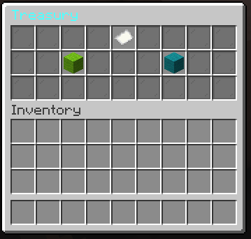
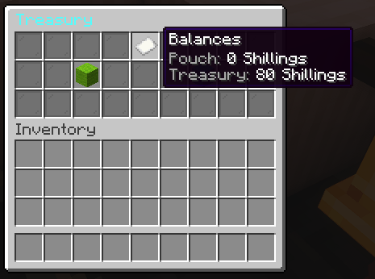
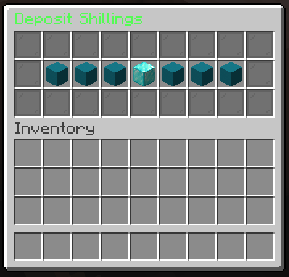
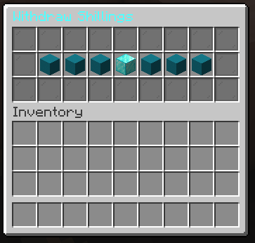

# FeatherfallBank
*A clean, GUI-first economy layer for Paper 1.21.x*


FeatherfallBank replaces fiddly commands with an intuitive **bell-triggered** bank GUI:
**Balance • Deposit • Withdraw**. It enforces configurable “death tax,” integrates with
**WorldGuard** safe zones, and ships with safe, sane defaults.


---

## ✨ Features

- **GUI-first**: Right-click a **bell** to open the bank.
- **Player commands (optional convenience):**
    - `/pouch` → Display Pouch Balance
    - `/pouch drop <amount>` → Drop Specified amount from Pouch
- **Safe-zone rules**: With WorldGuard regions, drop **0%** in protected areas.
- **Death tax**: Configurable (default **50%**) pouch drop on death.
- **Polished UX**: Button denominations with confirm/back; no item pickup in menus.
- **SQLite by default**: Works out of the box; MySQL optional.
- **PlaceholderAPI**: `%featherfallbank_balance%`, `%featherfallbank_currency%`.
- **Anti-abuse**: Click-cancel in menus, spam debounce; (future) secure note NBT.
- **Lightweight**: Minimal dependencies; sensible logging and telemetry toggles.


---

## 📦 Requirements

- **Paper** 1.21.x
- *(Optional)* **WorldGuard** for safe-zones
- *(Optional)* **PlaceholderAPI** for placeholders

---

## 🔧 Installation

1. Download the latest jar and drop it into `/plugins/`.
2. Start your server once to generate configs.
3. Edit `/plugins/FeatherfallBank/config.yml` and `messages.yml` as desired.
4. Restart the server.

On first run, the plugin also drops a `/plugins/FeatherfallBank/README-Server.md` quick-start
for admins.

---

## 🏦 Quickstart

- Place a **Bell** in your Treasury area. (the bell's cords will need specified via the config.ym)
- If you want region-restricted access, create a WorldGuard region (e.g., `OwlRun`) and set:

yaml
```safe_zones:
  enable_worldguard: true
  regions: ["OwlRun", "Spawn"]
gui:
  open_via:
    teller_block_types: ["BELL"]
    require_worldguard_region: true
    regions: ["OwlRun", "Spawn"]
```
Right-click the bell to open the bank GUI.

⚙️ **Configuration Highlights**
```yaml
Copy code
currency:
  name_singular: "Shilling"
  name_plural: "Shillings"
  symbol: "Ꞩ"
  format:
    use_commas: true
    decimal_places: 0

gui:
  titles:
    main: "<gold>Featherfall Bank</gold>"
  denominations: [1, 5, 10, 50, 100, 1000]
  confirm_clicks: true
  close_on_confirm: true
  sounds:
    open: UI_BUTTON_CLICK
    confirm: ENTITY_EXPERIENCE_ORB_PICKUP

death:
  drop_percent: 0.5                # 50% on death
  respect_keep_inventory: true
  worlds_excluded: []              # e.g., ["creative"]

safe_zones:
  enable_worldguard: true
  regions: ["OwlRun", "Spawn"]     # 0% drop here
```
Full config is generated at `/plugins/FeatherfallBank/config.yml.`

---

## 🔐 **Commands & Permissions**

**Player**
- `/pouch` → Displays Pouch Balance
- `/pouch drop <amount>` → Drops Specified Amount from Pouch

---

## 🧩 PlaceholderAPI

`%featherfallbank_balance%` → formatted balance

`%featherfallbank_currency%` → “Shillings”

---

## 🗺️ Roadmap

- Physical currency notes (NBT-secured), pouch item toggle
- Citizens banker NPC support
- Player-to-player payment gesture (drop/pay)
- MySQL/H2 profiles
- Hologram leaderboard integration

---

## 📜 License

All Rights Reserved

KerricB 2025

---

## 🖼️ Screenshots

**Treasury (bell) GUI**



**Balances** 



**Deposit Menu**



**Withdraw Menu**



---

## 🙏 Credits
**Author:** ItsEminus (KerricB)

Built for OwlCraft with love and lots of test deaths. 🦉


